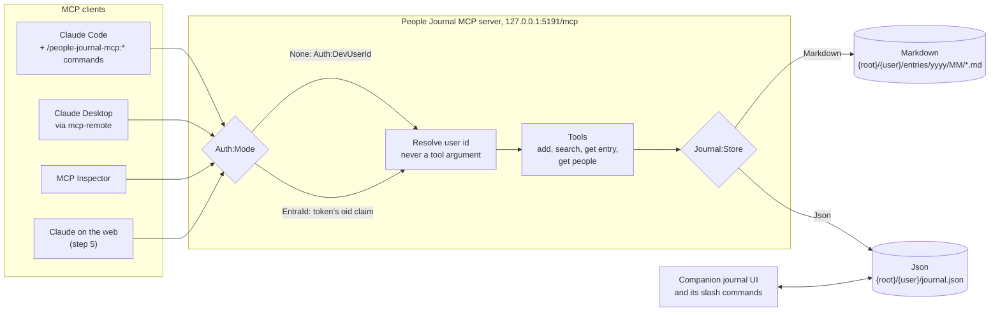
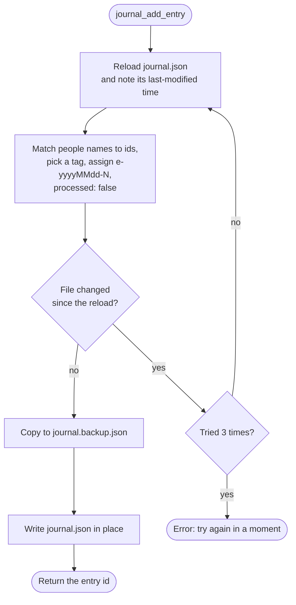
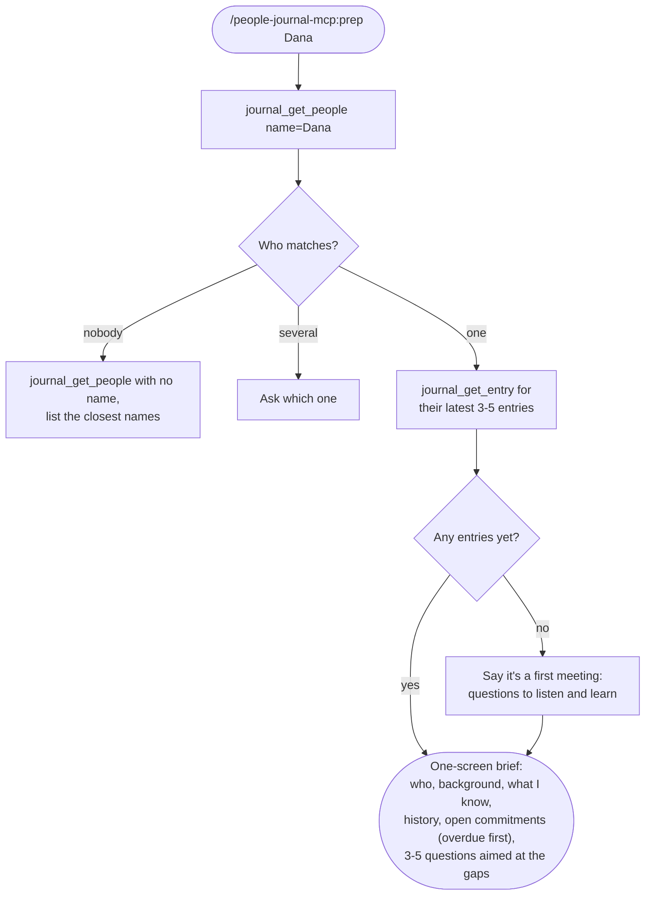
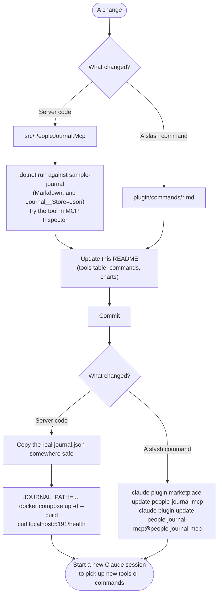

# People Journal MCP Server

A people journal (conversations, learnings, reflections) exposed over the Model Context Protocol. It stores entries in one of two
ways (`Journal:Store`): plain markdown files with YAML frontmatter (`Markdown`, the default for
`dotnet run`), or a companion UI's single `journal.json` (`Json`, used by Docker Compose).
The server is written in C# on ASP.NET Core with the official MCP C# SDK.

## How it works



The user id comes from the request, not from the model, so a tool call can't choose whose journal to use.
In `Json` mode the server shares `journal.json` with a companion UI, so it follows the same save rule:

## Run it locally (Docker)

```bash
docker compose up --build
curl http://localhost:5191/health
```

By default this mounts the fictional `sample-journal/` folder, so it is safe to demo on a
shared screen. To point it at your real journal:

```bash
JOURNAL_PATH=~/my-journal-data docker compose up
```

Without Docker: `cd src/PeopleJournal.Mcp && dotnet run --urls http://localhost:5191`.



Names it can't match are kept at the end of the text ("People not yet in the journal: ..."), and tags outside
`business/org/tech/politics` as "Topics: ...", so nothing the caller sent is lost.

## Connect a client

The MCP endpoint is `http://127.0.0.1:5191/mcp`.

- **MCP Inspector** (best for teaching, shows raw requests):
  `npx @modelcontextprotocol/inspector`, choose Streamable HTTP, enter the URL.
- **Claude Code**:
  `claude mcp add --transport http people-journal http://127.0.0.1:5191/mcp`
- **Claude Desktop** (local config bridge): add to the Desktop config
  ```json
  { "mcpServers": { "people-journal": {
      "command": "npx", "args": ["-y", "mcp-remote", "http://127.0.0.1:5191/mcp"] } } }
  ```
- **Claude on the web**: needs a public HTTPS URL and Entra ID sign-in. See step 5.

Try: "What have I discussed with the CFO?", "Who is Dana, and what do I owe the CFO?" or "Log a reflection: today I learned..."

## Tools

| Tool | What it does |
| --- | --- |
| `journal_add_entry` | Saves a new entry (1on1, meeting, learning, decision, reflection, teaching) |
| `journal_search_entries` | Filters by text, person (partial match), type, tag, date; newest first |
| `journal_get_entry` | Returns one entry's full text |
| `journal_get_people` | Without a name, lists everyone with a one-line summary. With a name (partial, or a title like `CFO`), returns their full record: notes, open commitments, pasted LinkedIn background and latest entries. The markdown store only knows names from entries, so it returns names, last entry and entry count |

## How identity works

Tools never take a user ID as input. The server works out whose journal to use:

- `Auth:Mode=None` (local demos): every caller is `Auth:DevUserId`.
- `Auth:Mode=EntraId`: the user's `oid` claim from a validated Entra ID token.

Each user's journal lives under `{RootPath}/{userId}/` (`entries/` for markdown, `journal.json`
for Json). Paths are checked so a request can't escape that folder.

## Teaching path

The server is built up in five steps. Steps 1 and 2 are in `main` today; 3 to 5 are planned.
Tag each step as it lands (`git tag step-3-resources`) so learners can check out any stage.

| Step | What it adds | Status |
| --- | --- | --- |
| 1. Hello | One tool, MCP Inspector connected | Done (folded into step 2) |
| 2. Journal | `journal_add_entry`, `journal_search_entries`, `journal_get_entry`, `journal_get_people`; markdown or `journal.json` storage | Done |
| 3. Resources | Plan and people exposed as MCP resources (people are already readable through `journal_get_people`) | Planned |
| 4. Prompts | `prep_1on1` and `weekly_review` prompts, so the workflows work in any client (`/people-journal-mcp:prep` covers Claude Code today) | Planned |
| 5. Remote | Entra ID auth, public HTTPS, Claude on the web | Planned (outline below) |

## Step 5 outline: Entra ID

1. Register an app in Entra ID. Under **Expose an API**, set the Application ID URI
   (`api://<client-id>`) and add the scope `journal.readwrite`.
2. In the app manifest, set the access token version to 2.
3. Configure `Auth__Mode=EntraId`, `Auth__TenantId`, `Auth__ClientId`.
4. Entra ID doesn't support dynamic client registration, so give Claude a client ID and
   secret in the custom connector's advanced settings, and add Claude's OAuth callback URL
   (see Anthropic's custom connector docs) as a redirect URI.
5. Host it at a public HTTPS URL. For a demo, a tunnel (Microsoft Dev Tunnels, ngrok) works;
   long term, a company-owned cloud account.

Never run `Auth:Mode=None` on a public URL.

## Slash commands (plugin)

`plugin/` is a Claude Code plugin with two commands. The plugin name is the prefix, so it's always
clear which app a command comes from. It expects the MCP server registered as `people-journal`.

| Command | Does |
| --- | --- |
| `/people-journal-mcp:learn <what I learned>` | Saves a `learning` entry and points out related past entries |
| `/people-journal-mcp:prep <name or role>` | One-screen brief before meeting someone: who they are, notes, history, open commitments and questions worth asking (uses `journal_get_people`) |

### How `/people-journal-mcp:prep` works



It uses only what the journal says. A companion app can build on it; the director-journal app's
`/director-journal:prep` runs this command, then adds its own coaching layer.

### Install and update

```bash
claude plugin marketplace add /path/to/people-journal-mcp
claude plugin install people-journal-mcp@people-journal-mcp
```

The installed copy is versioned by git commit. After editing a command, commit it, then run
`claude plugin marketplace update people-journal-mcp` and
`claude plugin update people-journal-mcp@people-journal-mcp`, then start a new session.

## Changing the server


